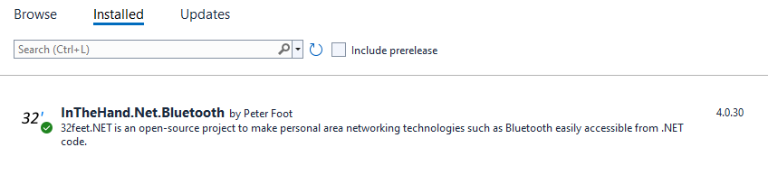
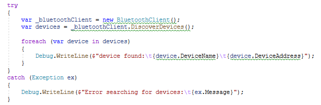
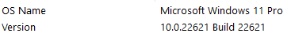

[This repo](https://github.com/TwoTicketsPls/Maui-32Feet-Issue) holds some simple example code to reproduce the issue reported [here](https://github.com/inthehand/32feet/issues/202#issue-1289584753).

It contains two Visual Studio projects. One is MAUI based. One is WPF based.

Both are bare bones scaffolding right from the "Create new project" dialog in VS.

Each has the `InTheHand.Net.Bluetooth` nuget package installed.



Each implements the following code:



The WPF version finds two devices on my machine and outputs something like:

```

	device found:	name-1	C1847E39A49E
	device found:	name-2  99D331F4426D

```

The computer is running Windows 11. The `Settings > Bluetooth & devices` UI shows both found devices as being paired.



The MAUI version throws an exception with the message "`A method was called at an unexpected time.`"

Call stack is:

```

   at System.Runtime.InteropServices.Marshal.ThrowExceptionForHR(Int32 errorCode)
   at WinRT.DelegateExtensions.DynamicInvokeAbi(Delegate del, Object[] invoke_params)
   at ABI.Windows.Foundation.IAsyncOperationMethods`1.GetResults(IObjectReference _genericObj)
   at ABI.Windows.Foundation.IAsyncOperation`1.global::Windows.Foundation.IAsyncOperation<TResult>.GetResults()
   at InTheHand.Net.Sockets.BluetoothClient.PlatformDiscoverDevices(Int32 maxDevices)
   at InTheHand.Net.Sockets.BluetoothClient.DiscoverDevices(Int32 maxDevices)
   at InTheHand.Net.Sockets.BluetoothClient.DiscoverDevices()
   at Maui_32_Feet_Issue.MainPage.OnCounterClicked(Object sender, EventArgs e) in C:\Maui-32-Feet_Issue\Maui-32-Feet_Issue\MainPage.xaml.cs:line 27

```


Visual Studio: `VisualStudioVersion = 17.0.31611.283`


 